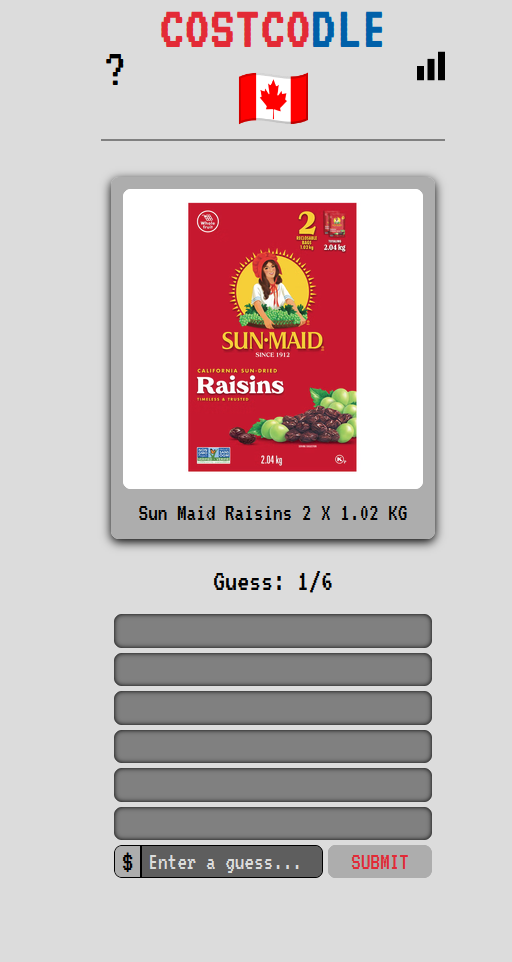

<a name="readme-top"></a>

<!-- PROJECT LOGO -->
<br />
<div align="center">
  <a href="https://costcodle-canada.onrender.com/">
    
  </a>

<h3 align="center">COSTCODLE 🇨🇦</h3>

  <p align="center">
    A Wordle-esque daily guessing game for Costco food products!
    <br />
    <br />
    <a href="https://costcodle-canada.onrender.com/">View Demo</a>
  </p>

</div>

<!-- ABOUT THE PROJECT -->
## About The Project

This is an adapted version of COSTCODLE for Canadians that uses Canadian dollars. Unlike the original it also pulls data from a live database, namely https://www.cocopricetracker.ca/, rather than using hardcoded games and prices. It also strips out some of the tracking telemetry in the original.

<div align="center">
  
</div>

Guess the COSTCODLE in 6 tries.

* Each guess must be a valid price.
* Incorrect guesses will help guide you to the target price.

If you guess within 5% of the target price, you win!

A new COSTCODLE is available every day!

### Run Locally

Requires Node.js 18 or newer.

```bash
node server.js
```

Then open http://localhost:8000. The local server serves the site and proxies live item data through `/api/items` to avoid browser CORS restrictions.

<!-- LICENSE -->
## License

Distributed under the MIT License. See `LICENSE.txt` for more information.

<!-- ACKNOWLEDGMENTS -->
## Acknowledgments

Zachary Kermitz  - zakkermitz@gmail.com for creating the base I could adapt to the Canadian version 
